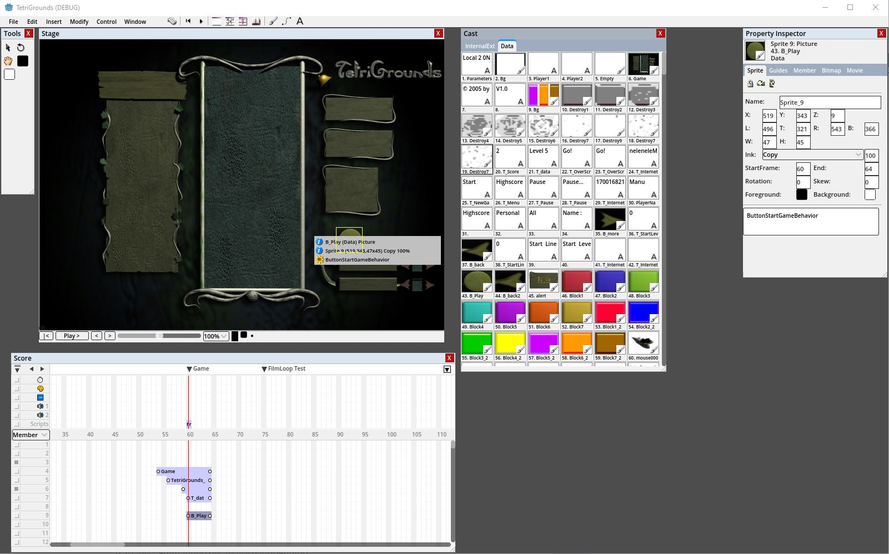
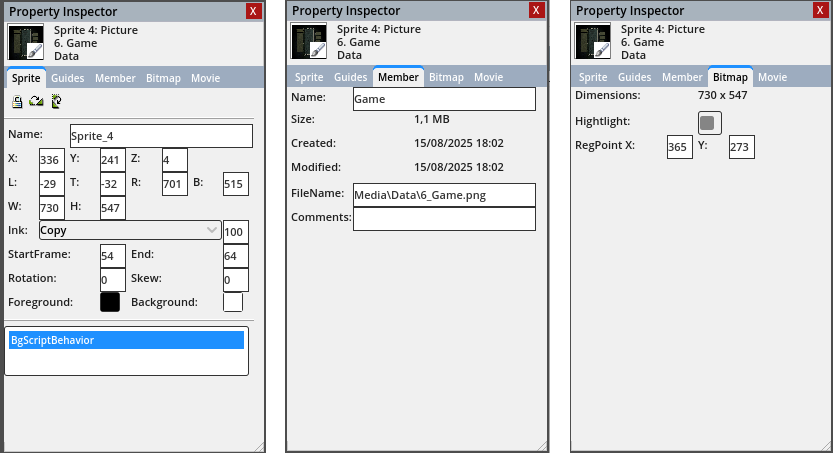
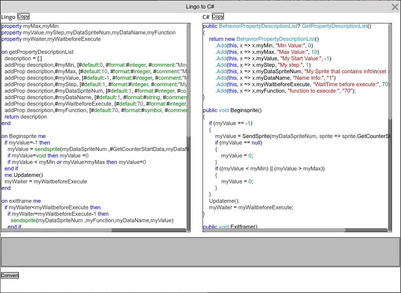

# LingoEngine


**LingoEngine** is a modern, cross-platform C# runtime designed to emulate Macromedia Director's **Lingo** scripting language. It enables playback of original Lingo code and behaviors on top of modern rendering backends like **Godot**, **SDL2**, **Unity**, and **Blazor**, allowing legacy projects to be revived or reimagined with full flexibility.


### Director.NET



#### Property inspector



#### Easy Lingo to C# conversion
File by file or in batch with the lingo importer.




## ✨ Key Features of the engine

- ✅ **Lingo Script Execution** – Runs legacy Macromedia Director scripts directly in C#.
- 🔌 **Pluggable Rendering Backends** – Clean architecture supporting:
  - [Godot Engine](https://godotengine.org/)
  - [SDL2](https://www.libsdl.org/)
  - [Unity](https://unity.com/)
  - [Blazor](https://dotnet.microsoft.com/apps/aspnet/web-apps/blazor)
- 🧠 **Director application** – Offers basic movie, cast, and score compatibility and can run standalone or as a library in your project.
- 🧩 **Modular Runtime Architecture** – Clear separation of concerns: input, rendering, audio, system services, and script execution.
- ⚙️ **Service-Oriented Initialization** – Uses dependency injection and service collections for clean setup.
- 🌍 **Cross-Platform Compatibility** – Works anywhere the .NET SDK is available.

---

## Help making this project!


> ⚠️ **Can you help us make this dream project come true?**  
> This project is still under heavy development, and we can use some help. Reach out if you want to contribute.
.
.

---

## ⭐ Why Use LingoEngine?

- 🚀 Port legacy Director projects to modern engines
- 🔁 Reuse existing assets, scripts, and logic
- 🛠️ Build hybrid projects that combine old logic with new rendering
- 🕹️ Explore the inner workings of Director games using readable C# code
- 💾 Preserve interactive media history with a modern toolset

---

## 🚀 Running the Demo

1. **Clone the repository**:

   ```bash
   git clone https://github.com/EmmanuelTheCreator/LingoEngine.git
   cd LingoEngine
   ```

2. **Install prerequisites**
   Ensure the .NET 8 SDK is available. You can install it using the helper script:

   ```bash
   ./scripts/install-dotnet.sh
   ```

3. **Open the solution**
   Open `LingoEngine.sln` in your preferred C# IDE (Visual Studio / Rider).

4. **Build a demo**
   Navigate to `Demo/TetriGrounds` and run one of the included platform integrations.

👉 Use the dedicated guides for full setup instructions:

- [Godot Setup](docs/GodotSetup.md)
- [SDL2 Setup](docs/SDLSetup.md)
- [Blazor Demo](docs/BlazorDemo.md)

### VS Code Setup

1. Install the [.NET SDK](https://learn.microsoft.com/dotnet/core/install/) and [Godot 4](https://godotengine.org/) with C# support.
2. Open the repository folder in VS Code and accept the recommended extensions.
3. Press <kbd>Ctrl</kbd>+<kbd>Shift</kbd>+<kbd>B</kbd> to build the solution.
4. From the Run and Debug panel choose **Launch Demo SDL2** or **Launch Demo Godot**.


---

## 🎮 Getting Started with Development

Both the SDL2 and Godot frontends share the same backend logic. Here's an example of how to bootstrap the SDL2 engine:

```csharp
var services = new ServiceCollection();
services.RegisterLingoEngine(cfg => cfg
    .WithLingoSdlEngine("TetriGrounds", 1280, 960)
    .SetProjectFactory<LingoEngine.Demo.TetriGrounds.Core.TetriGroundsProjectFactory>()
    .BuildAndRunProject());

var provider = services.BuildServiceProvider();
provider.GetRequiredService<SdlRootContext>().Run();
```
The window dimensions above create a Director window larger than the 640×480 stage configured in the project factory.

Swap to the Godot backend by using `.WithLingoGodotEngine(...)`.

📄 See the [Getting Started guide](docs/GettingStarted.md), [Godot Setup](docs/GodotSetup.md), [SDL2 Setup](docs/SDLSetup.md), and [Blazor Demo](docs/BlazorDemo.md) for exact details.

---

## 📚 Documentation

### Guides

- [Getting Started](docs/GettingStarted.md)
- [Lingo vs C# Differences](docs/Lingo_vs_CSharp.md)
- [Architecture Overview](docs/Architecture.md)
- [Godot Setup](docs/GodotSetup.md)
- [SDL2 Setup](docs/SDLSetup.md)
- [Blazor Demo](docs/BlazorDemo.md)
- [Project Setup](docs/ProjectSetup.md)
- [Progress Log](docs/Progress.md)
- [Director Keyframe Tags](docs/director_keyframe_tags.md)
- [Director Lingo MX2004 Scripting Guide](docs/Director_Lingo_mx2004_scripting.pdf)
- [XMED File Comparisons](docs/XMED_FileComparisons.md)
- [XMED Offsets](docs/XMED_Offsets.md)
- [Text Styling Example](docs/Text_Multi_Line_Multi_Style.md)

### API Reference

Documentation generated from the source code is available using [DocFX](https://github.com/dotnet/docfx). Run `scripts/build-docs.sh` (or `scripts/build-docs.ps1` on Windows) to produce the site in `docs/docfx/_site`. The pages include "View Source" links back to the repository.

---

## 🧭 Roadmap

| Feature                                | Status       |
|----------------------------------------|--------------|
| Full Lingo language support            | In Progress  |
| Standalone Director application        | Basic support |
| Backends: Godot, SDL2, Unity, Blazor   | ✅ Implemented |
| Documentation & learning materials     | In Progress  |
| Lingo bytecode (dcode) interpreter     | Experimental |

---

## 🤝 Contributing

We welcome contributions from the community!

To get started:

1. Fork this repository
2. Create a feature branch
3. Write your code and tests
4. Submit a pull request

Please include examples or documentation when appropriate.

Please also read our [Code of Conduct](CODE_OF_CONDUCT.md).

---

## 📄 License

Licensed under the [MIT License](LICENSE).

> **Note:** The TetriGrounds demo's assets are not covered by the MIT License. See [Demo/TetriGrounds/LICENSE.assets.txt](Demo/TetriGrounds/LICENSE.assets.txt) for details.

---

## 🙋‍♂️ Questions or Feedback?

Feel free to [open an issue](https://github.com/EmmanuelTheCreator/LingoEngine/issues) or start a discussion. We're happy to help, and open to ideas!

