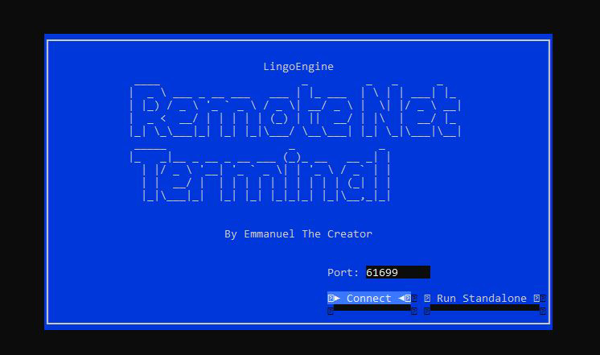

# BlingoEngine


**BlingoEngine** is a modern, cross-platform C# runtime designed to emulate Macromedia Director's **Lingo** scripting language. It enables playback of original Lingo code and behaviors on top of modern rendering backends like **Godot**, **SDL2**, **Unity**, and **Blazor**, allowing legacy projects to be revived or reimagined with full flexibility.


---

### Director.NET


#### Property inspector


#### Easy Lingo to C# conversion
File by file or in batch with the lingo importer.


#### Remote Terminal
An easy way to debug your game, run the Remote Terminal trough pipes or SignalR.




## ✨ Key Features of the engine

- ✅ **Lingo Script Execution** – Runs legacy Macromedia Director scripts directly in C#.
- 🔌 **Pluggable Rendering Backends** – Clean architecture supporting:
  - [Godot Engine](https://godotengine.org/)
  - [SDL2](https://www.libsdl.org/)
  - [Unity](https://unity.com/)
  - [Blazor](https://dotnet.microsoft.com/apps/aspnet/web-apps/blazor)
- 🧠 **Director application** – Offers basic movie, cast, and score compatibility and can run standalone or as a library in your project.
- 🧩 **Modular Runtime Architecture** – Clear separation of concerns: input, rendering, audio, system services, and script execution.
- ⚙️ **Service-Oriented Initialization** – Uses dependency injection and service collections for clean setup.
- 🌍 **Cross-Platform Compatibility** – Works anywhere the .NET SDK is available.

---

## Help making this project!


> ⚠️ **Can you help us make this dream project come true?**
> This project is still under heavy development, and we can use some help. Reach out if you want to contribute.
> 🚧 **Warning:** The Director SDL integration is still under heavy development and is not yet functional.
.
.

---

## 🎉 Standing on the Shoulders of Giants

**Macromedia Director** and its **Lingo language** were revolutionary in their time, like [John Henry Thompson ](https://johnhenrythompson.com/johnhenrythompson/) and [Marc Canter](https://en.wikipedia.org/wiki/Marc_Canter) who created them.
They empowered an entire generation of artists, educators, and game developers to create interactive experiences long before today’s engines existed.

Director pioneered ideas that shaped the future of digital creativity:  
- The **stage, cast, and score** metaphor made multimedia authoring approachable  
- The **Lingo scripting language** gave non-programmers the power to create interactivity  
- A vibrant global community pushed the boundaries of art, education, and entertainment  

**BlingoEngine** is not here to replace Director, but to *honor its spirit* — carrying those ideas forward into the modern era so they can continue to inspire.  

| Director’s Legacy ✨            | BlingoEngine’s Contribution 🚀 |
|--------------------------------|--------------------------------|
| First accessible multimedia authoring tool for creatives | Keeps Lingo projects alive on modern platforms |
| Introduced the stage, cast, score, and Lingo scripting concepts | Brings those concepts into C# and today’s engines |
| Enabled art, education, and indie game communities worldwide | Opens them again for exploration, study, and reuse |
| Inspired countless developers and later tools (Flash, Unity, etc.) | Bridges history with modern ecosystems like Godot, SDL2, Unity, Blazor |

> 🧡 To the Director developers and community:  
> we applaud your achievements, and BlingoEngine exists thanks to the foundation you built.


---

## ⭐ Why Use BlingoEngine?

- 🚀 Port legacy Director projects to modern engines  
- 🔁 Reuse existing assets, scripts, and logic  
- 🛠️ Build hybrid projects that combine old logic with new rendering  
- 🕹️ Explore the inner workings of Director games using readable C# code  
- 💾 Preserve interactive media history with a modern toolset  


---
## The Lingo Verbose Language
Looking for a more expressive C# syntax? The `BlingoEngine.VerboseLanguage` package offers a fluent API that mirrors classic Lingo statements.


```csharp
// Lingo : put the Text of member "Paul Robeson" into member "How Deep"

// C# with BlingoEngine.VerboseLanguage
Put(The().Text.Of.Member("Paul Robeson")).Into.Field("How Deep");
```

## 🚀 Running the Demo

1. **Clone the repository**:

   ```bash
   git clone https://github.com/EmmanuelTheCreator/BlingoEngine.git
   cd BlingoEngine
   ```

2. **Run installer with prerequisites**
   Ensure the .NET 8 SDK is available. You can install it using the helper script:

Linux:
   ```bash
   ./setup-linux.sh
   ```
Windows:
   ```bash
   ./setup-windows.sh
   ```

3. **Open the solution**
   Open `BlingoEngine.sln` in your preferred C# IDE (Visual Studio / Rider).

4. **Build a demo**
   Navigate to `Demo/TetriGrounds` and run one of the included platform integrations.

👉 Use the dedicated guides for full setup instructions:

- [Godot Setup](docs/GodotSetup.md)
- [SDL2 Setup](docs/SDLSetup.md)
- [Blazor Demo](docs/BlazorDemo.md)
- [Sample Projects](Samples/ReadMe.md)

### VS Code Setup

1. Install the [.NET SDK](https://learn.microsoft.com/dotnet/core/install/) and [Godot 4.5](https://godotengine.org/) with C# support.
2. Open the repository folder in VS Code and accept the recommended extensions.
3. Press <kbd>Ctrl</kbd>+<kbd>Shift</kbd>+<kbd>B</kbd> to build the solution.
4. From the Run and Debug panel choose **Launch Demo SDL2** or **Launch Demo Godot**.


---

## 🎮 Getting Started with Development

Need a concrete reference? Check the [Sample Projects overview](Samples/ReadMe.md) for minimal SDL2 and Godot setups.

Both the SDL2 and Godot frontends share the same backend logic. Here's an example of how to bootstrap the SDL2 engine:

```csharp
var services = new ServiceCollection();
services.RegisterBlingoEngine(cfg => cfg
    .WithBlingoSdlEngine("TetriGrounds", 1280, 960)
    .SetProjectFactory<BlingoEngine.Demo.TetriGrounds.Core.TetriGroundsProjectFactory>()
    .BuildAndRunProject());

var provider = services.BuildServiceProvider();
provider.GetRequiredService<SdlRootContext>().Run();
```
The window dimensions above create a Director window larger than the 640×480 stage configured in the project factory.

Swap to the Godot backend by using `.WithBlingoGodotEngine(...)`.

📄 See the [Getting Started guide](docs/GettingStarted.md), [Godot Setup](docs/GodotSetup.md), [SDL2 Setup](docs/SDLSetup.md), and [Blazor Demo](docs/BlazorDemo.md) for exact details.

---

## 📚 Documentation

### Guides

- [Getting Started](docs/GettingStarted.md)
- [Lingo vs C# Differences](docs/design/Blingo_vs_CSharp.md)
- [Architecture Overview](docs/design/Architecture.md)
- [Godot Setup](docs/GodotSetup.md)
- [SDL2 Setup](docs/SDLSetup.md)
- [Blazor Demo](docs/BlazorDemo.md)
- [Project Setup](docs/design/ProjectSetup.md)
- [Progress Log](docs/Progress.md)
- [Director Keyframe Tags](docs/DirDissasembly/director_keyframe_tags.md)
- [Director Lingo MX2004 Scripting Guide](docs/Director_Blingo_mx2004_scripting.pdf)
- [XMED File Comparisons](docs/DirDissasembly/XMED_FileComparisons.md)
- [XMED Offsets](docs/DirDissasembly/XMED_Offsets.md)
- [Text Styling Example](docs/DirDissasembly/Text_Multi_Line_Multi_Style.md)

### API Reference

Documentation generated from the source code is available using [DocFX](https://github.com/dotnet/docfx). Run `scripts/build-docs.sh` (or `scripts/build-docs.ps1` on Windows) to produce the site in `docs/docfx/_site`. The pages include "View Source" links back to the repository.

---

## 🧭 Roadmap

### 🟣 BlingoEngine Runtime ▓▓▓▓▓▓▓░ 70%
The core runtime that executes Lingo scripts and connects to backends.

#### Core
| Feature                          | Status / Progress |
|----------------------------------|-------------------|
| Lingo Script Execution           | ✅ Stable |
| Lingo → C# Conversion            | ███████▌░░ 75% |
| Lingo bytecode (dcode) interpreter | â–‘â–‘â–‘â–‘â–‘â–‘â–‘â–‘â–‘â–‘ Experimental |

#### Backends
| Backend                          | Status / Progress |
|----------------------------------|-------------------|
| Godot Backend                    | ✅ Tested, working |
| SDL2 Backend                     | ✅ Tested, working |
| Unity Backend                    | ██████░░░░ 70% (written, not fully tested) |
| Blazor Backend                   | ██████░░░░ 70% (written, not fully tested) |

#### Features
| Feature                          | Status / Progress |
|----------------------------------|-------------------|
| FilmLoops                        | ✅ Done |
| Transitions                      | ✅ Done |
| Audio Playback                   | ✅ Done |
| Sprites2D                        | ✅ Done |
| Video Playback                   | █████████░ 90% |
| Macromedia Flash Integration     | â–‘â–‘â–‘â–‘â–‘â–‘â–‘â–‘â–‘â–‘ Far future (0%) |
| BlingoEngine 3D                   | â–‘â–‘â–‘â–‘â–‘â–‘â–‘â–‘â–‘â–‘ Early idea (2%) |

---

### 🟠 Director Application ▓▓▓░░░░░ 35%
A modern reimplementation of Director’s movie, cast, and score system on top of the runtime.

#### Backends
| Backend                          | Status / Progress |
|----------------------------------|-------------------|
| Godot Frontend                   | ██████░░░░ 65% |
| SDL2 Frontend                    | █░░░░░░░░░ 15% |
| Unity Frontend                   | â–‘â–‘â–‘â–‘â–‘â–‘â–‘â–‘â–‘â–‘ Planned |
| Blazor Frontend                  | â–‘â–‘â–‘â–‘â–‘â–‘â–‘â–‘â–‘â–‘ Planned |

#### Core Systems
| Feature                          | Status / Progress |
|----------------------------------|-------------------|
| Score                            | ✅ Done |
| Cast                             | ✅ Done |
| Tempo                            | ✅ Done |
| Property Inspector               | ✅ Done |
| Text Editing                     | █████░░░░░ 70% |
| Picture Painter (Godot)          | ██░░░░░░░░ 30% (🎨 experimental / fun) |
| Shape Painter                    | â–‘â–‘â–‘â–‘â–‘â–‘â–‘â–‘â–‘â–‘ 0% (todo) |
| Color Palettes                   | █░░░░░░░░░ 5% |
| Orion Skin                       | â–‘â–‘â–‘â–‘â–‘â–‘â–‘â–‘â–‘â–‘ 0% (planned) |
| Behavior Code Library            | â–‘â–‘â–‘â–‘â–‘â–‘â–‘â–‘â–‘â–‘ 0% (planned) |
| .dir File Importer               | ████░░░░░░ 50% |

---

✅ = ready and tested  
⏳ = in progress  
🧪 = experimental  
🎨 = playful / for fun  


---

## 🤝 Contributing

We welcome contributions from the community!

To get started:

1. Fork this repository
2. Create a feature branch
3. Write your code and tests
4. Submit a pull request

Please include examples or documentation when appropriate.

Please also read our [Code of Conduct](CODE_OF_CONDUCT.md).

---

## Architecture overview.


---

## 📄 License

Licensed under the [MIT License](LICENSE).

> **Note:** The TetriGrounds demo's assets are not covered by the MIT License. See [Demo/TetriGrounds/LICENSE.assets.txt](Demo/TetriGrounds/LICENSE.assets.txt) for details.

---

## 🙋‍♂️ Questions or Feedback?

Feel free to [open an issue](https://github.com/EmmanuelTheCreator/BlingoEngine/issues) or start a discussion. We're happy to help, and open to ideas!


