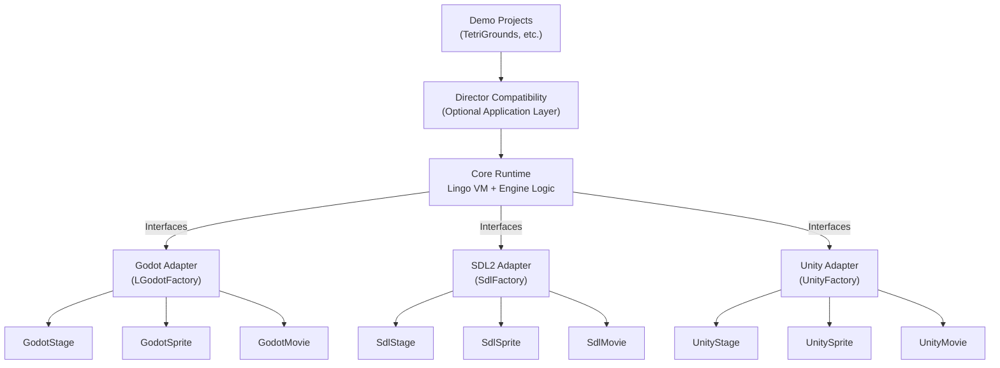
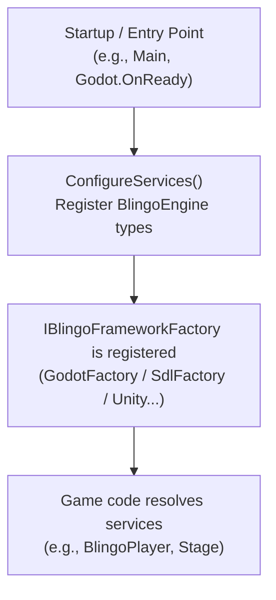
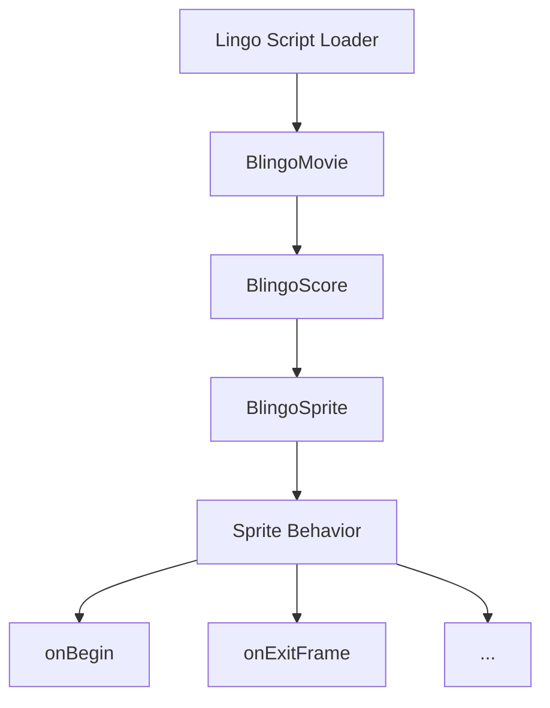
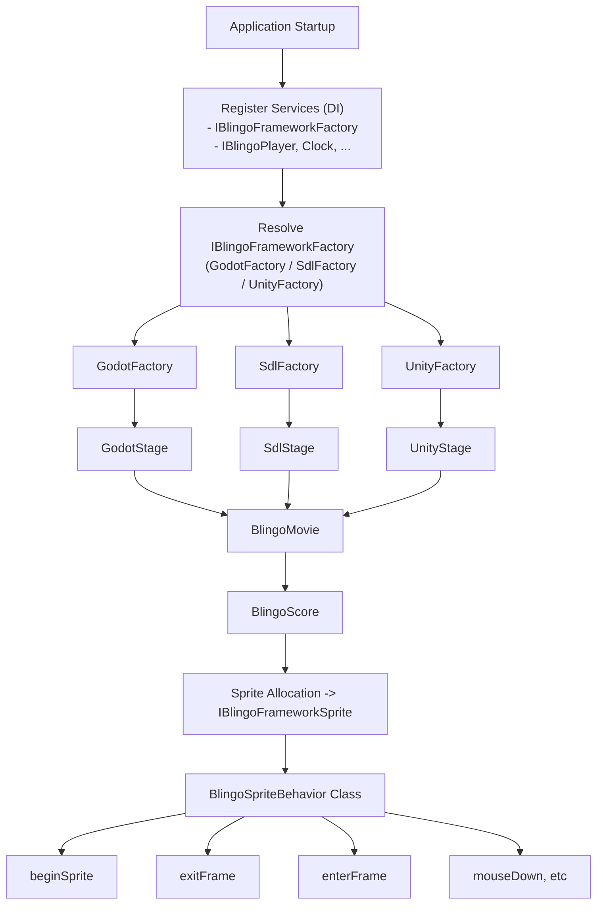

# 🏗️ BlingoEngine Architecture Overview

BlingoEngine is built as a **layered, modular system** that emulates the core behaviors of Macromedia Director using a modern C# runtime. Its architecture is designed to isolate core logic from platform-specific details — allowing you to reuse scripts and game logic across multiple rendering backends such as **Godot** and **SDL2**.

---

## 📐 Architecture Layers

BlingoEngine is organized into four main architectural layers:
| Layer               | Description |
|---------------------|----------------------------------------------------------------------------------------------------------------------------------|
| **Core**            | The Lingo language runtime and virtual machine (VM) — fully rendering-agnostic. |
| **Framework Adapters** | Abstractions that allow the engine to run on multiple rendering platforms (Godot, SDL2, etc.). |
| **Director Layer**  | Optional high-level components that mimic Macromedia Director's original movie/cast/score model. |
| **Demo Projects**   | Sample integrations demonstrating how to use BlingoEngine with real frameworks and games. |
Each adapter implements a well-defined set of interfaces to ensure the **core engine remains untouched** regardless of the target platform.

---

## 🔌 Interfaces & Implementations

At the heart of the engine is the `src/BlingoEngine` project. It defines the key **engine interfaces** that abstract away rendering and platform specifics:

- `IBlingoFrameworkStage` – represents the rendering surface
- `IBlingoFrameworkSprite` – represents visual sprite elements
- `IBlingoFrameworkMovie` – encapsulates timeline logic and score interaction
- `IBlingoFrameworkGfxNodeInput`, `IBlingoFrameworkMouse`, etc. – abstract input handling
- `IBlingoFrameworkFactory` – used to construct platform-native instances of all of the above

### Example: Framework Agnostic Usage

The core engine depends only on these interfaces:

```csharp
IBlingoFrameworkFactory factory = new GodotFactory(serviceProvider, root);
var stage = factory.CreateStage(new BlingoPlayer());
var movie = factory.AddMovie(stage, new BlingoMovie("Demo"));
```

This allows your game logic, Lingo scripts, and runtime behaviors to work **without ever knowing** if it's rendering with Godot or SDL2.

---

## 🏭 Factory Pattern

BlingoEngine uses the **Factory pattern** to inject framework-specific implementations.

- Each rendering adapter (e.g., Godot or SDL2) defines its own `IBlingoFrameworkFactory` implementation.
- These factories are usually registered in a **DI container** (e.g., `Microsoft.Extensions.DependencyInjection`).
- When the engine starts, it queries the factory to obtain the correct platform-native objects.

### Benefits:
- ✅ Decouples game logic from rendering details
- ✅ Allows easy addition of new adapters
- ✅ Encourages testability and interface-driven design

---

## 🧪 Adapter Implementations

Each adapter project (e.g., `BlingoEngine.LGodot` or `BlingoEngine.SDL2`) provides concrete implementations for the core interfaces:

| Adapter              | Provided Classes |
|----------------------|--------------------------------------------------------------|
| `BlingoEngine.LGodot` | `GodotStage`, `GodotSprite`, `GodotMovie`, `GodotFactory`    |
| `BlingoEngine.SDL2`   | `SdlStage`, `SdlSprite`, `SdlMovie`, `SdlFactory`            |
These map to native objects in the respective frameworks while still adhering to the engine contracts.

---

## 🎬 Optional Director Layer

The `src/Director` folder contains a **higher-level application layer** that mirrors Macromedia Director's built-in behaviors more closely:

- `BlingoEngine.Director.Movie` – manages movie playback and score state
- `BlingoEngine.Director.Cast` – emulates cast member access
- `BlingoEngine.Director.Stage` – provides legacy stage behaviors
- `BlingoEngine.Director.Key/Sound/System/...` – optional subsystems reflecting classic Director features

This layer is **optional** but useful for full-featured game recreation.

---

## 🧪 Demo Projects

Demo implementations such as `Demo/TetriGrounds` showcase how to wire everything together:

- Uses `ServiceCollection` to register components
- Boots the game through the correct adapter (`WithBlingoSdlEngine()` or `WithBlingoGodotEngine()`)
- Demonstrates script-driven gameplay using real Lingo behaviors

---

## 📌 Summary

BlingoEngine's architecture enables:

- 🔁 **Script portability** between rendering platforms
- 🔍 **Code clarity and separation of concerns**
- 🧱 **Scalable engine growth** through pluggable components
- 🕹️ **Faithful Director emulation** with optional compatibility layers

---


## 🧭 Architecture Diagram



### IOC Architecture Layers


This diagram illustrates how script handlers like onBeginSprite, onExitFrame, etc., are connected to the core VM logic and dispatched into sprite behaviors.



### A flow schema:

### Summary
- From application startup, services and adapters are registered into a DI container.
- The core engine then resolves platform-specific types via IBlingoFrameworkFactory.
- BlingoMovie and BlingoScore manage the timeline and sprite orchestration.
- Sprite behaviors respond to dispatched events such as enterFrame, exitFrame, mouseDown, etc.


## 📎 See Also

- [README.md](../../README.md)
- [Godot Setup Guide](../GodotSetup.md)
- [SDL2 Setup Guide](../SDLSetup.md)
- [Lingo vs C# Differences](Blingo_vs_CSharp.md)

---


